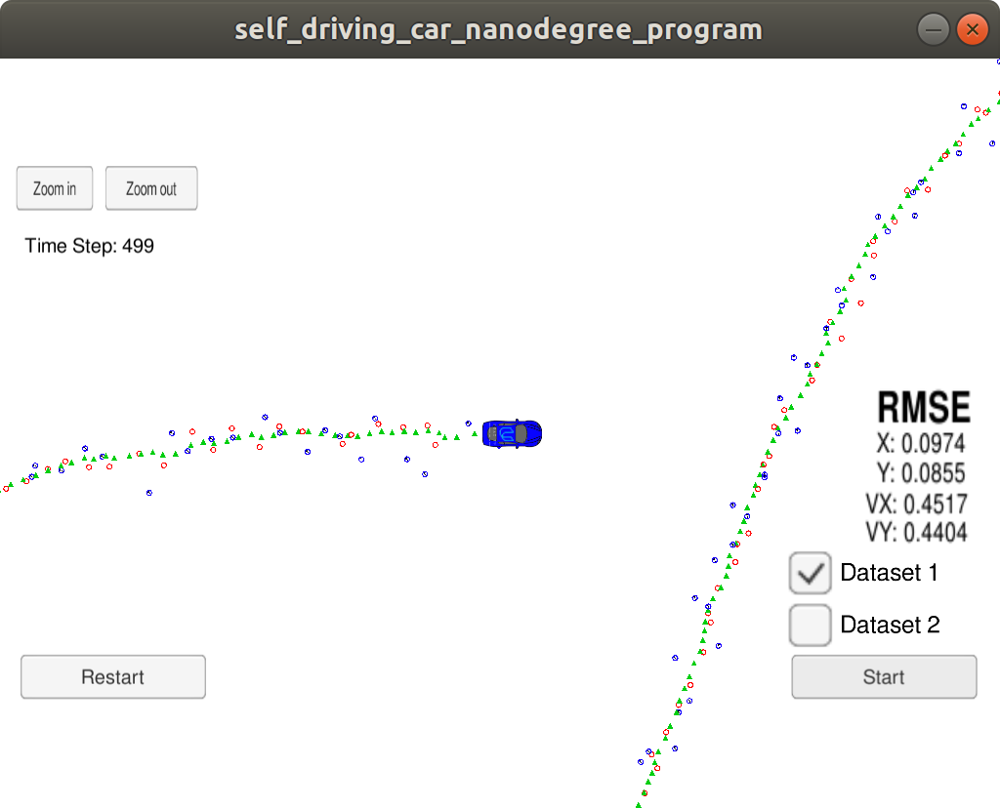

# Extended Kalman Filter Project

In this project, I utilized an extended kalman filter to estimate the state of a moving object of interest with noisy lidar and radar measurements. I was able to obtain RMSE values that are lower than the outlined tolerance of [.11, .11, 0.52, 0.52]. 

## Project Files

The programs consists of the following files are:
* [`src/FusionEKF.cpp`](https://github.com/iammsg/Project5/blob/master/src/FusionEKF.cpp) - This code processes the measurement derived from the sensors. 
* [`src/FusionEKF.h`](https://github.com/iammsg/Project5/blob/master/src/FusionEKF.h)
* [`src/kalman_filter.cpp`](https://github.com/iammsg/Project5/blob/master/src/kalman_filter.cpp) - This code contains the code which does the measurement and prediction steps for the Kalman Filter
* [`src/kalman_filter.h`](https://github.com/iammsg/Project5/blob/master/src/kalman_filter.h)
* [`src/tools.cpp`](https://github.com/iammsg/Project5/blob/master/src/tools.cpp) - This code contains functions to calculate the RMSE and the Jacobian matrix
* [`src/tools.h`](https://github.com/iammsg/Project5/blob/master/src/tools.h)
* [`src/measurement_package.h`](https://github.com/iammsg/Project5/blob/master/src/measurement_package.h) - This code stores the measurements and the type of sensor.

The file [`src\main.cpp`](https://github.com/iammsg/Project5/blob/master/src/main.cpp) comes directly from the project source code and have been used without any changes. 

These files work with the Term 2 simulator which can be downloaded [here](https://github.com/udacity/self-driving-car-sim/releases)

These were created in accordance to the [project rubric](https://review.udacity.com/#!/rubrics/1962/view)
